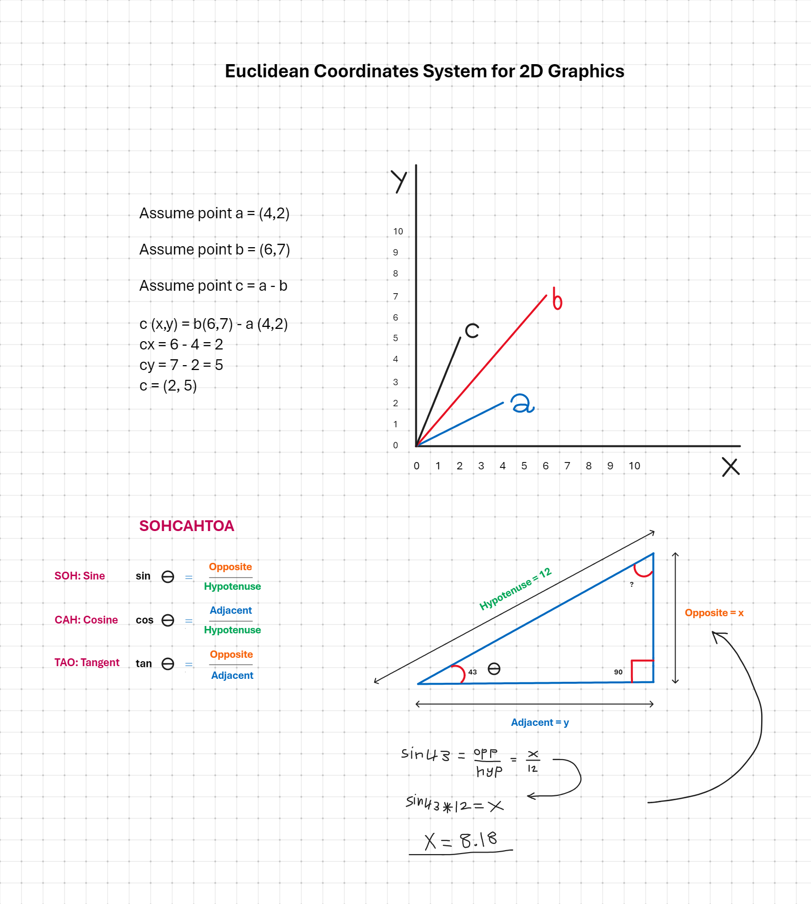
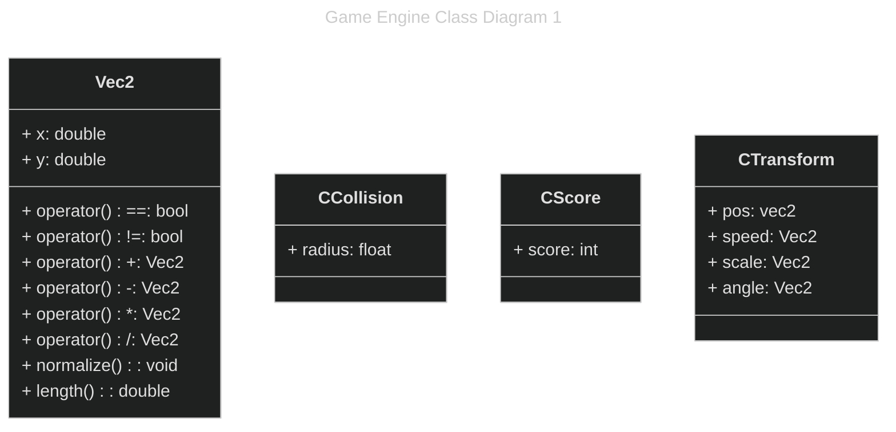
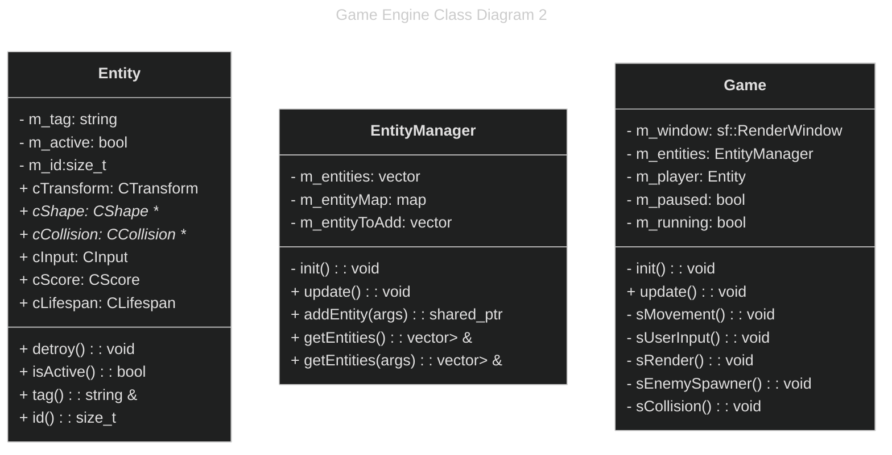
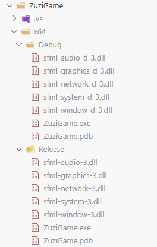

# EL Zuzi Game

Simple 2D game developed using C++, and SFML framework.

## Solution Architecture

Using Entity-Component-System (ECS) programming paradigm.
The naming convention of components must start with capital `C`, indicating that the object is a component.
Using smart pointers in C++ for better memory management, side-by-side with Resource Acquisition Is Initialization (RAII) programming technique, to tie the lifetime of a resource to the lifetime of an object.

The following diagram illustrates the ECS implementation workflow in the solution.


## Development Guidelines

Data should be separated from the logic code, to make sure that changing either will not affect the other.

The **Entity Manager** uses the factory design pattern, to handle the creation and lifetime of all objects.

For example in addition to the factory design pattern to be implemented, the entity manager may have functions that handle:

- `addEntity`
- `removeEntity`
- `storage`
- `bookKeeping`

Also, the implemented factory should make sure that the user cannot create its own entities.

**Entity Tags** we may want to group entities by some common factor, say functionality, in this case we need tags, that are of type string, or of type enum (integer) that can group our entities.

All entities will be stored in a vector of type shared pointer, as smart pointer for safer memory management.

For example of Entity Manager:

```c++
 // stores the entities
 typedef std::vector<std::shared_ptr<Entity>> EntityVector;
 // store the tags
 typedef std::map<std::string, EntityVector> EntityMap;

 class EntityManager {
    EntityVector m_entityVector;
    EntityMap m_entityMap;
    size_t m_totalEntities = 0;
public:
    EntityManager();
    std::shared_ptr<Entity> addEntity(const std::string& tag);
    EntityVector& getEntities();
    EntityVector& getEntities(const std::string& tag);
 }
```

**Iteration Invalidation** is caused by modifying the contents of a collation at the same time we are iterating through it.

Iteration invalidation happens almost always in games, while iterating through a vector array, vector functions, may cause memory reallocation by:

- Adding to vector using push_back, or insert functions.
- Resizing vector array by recreating internal array.
- Erasing element from vector array using erase, or pop_back functions.

Example of Iteration Invalidation:

```c++
void sCollision(){
    EntityVector bullets;
    EntityVector tiles;
    for (auto &b: bullets){
        for (auto &t: tiles){
            if(Physics::IsCollision(b,t))
            {
                bullets.erase(b);
            }
        }
    }
}
```

The base rule to avoid **Iteration Invalidation** is never modify an array during iteration.

**Delayed Effects** as an effective solution to **Iteration Invalidation**, by delaying the actions modifying the collections until it is safe to do so, and that can be achieved by adding a function to **Entity Manager** to update by requesting an update then executing it when it is safe.

Example of **Delayed Effects** entity manager with update function:

```c++
 // stores the entities
 typedef std::vector<std::shared_ptr<Entity>> EntityVector;
 // store the tags
 typedef std::map<std::string, EntityVector> EntityMap;

 class EntityManager {
    EntityVector m_entityVector;
    // entity to update container
    EntityVector m_entityToUpdate;
    EntityMap m_entityMap;
    size_t m_totalEntities = 0;
public:
    EntityManager();
    // update function
    void updateEntity();
    std::shared_ptr<Entity> addEntity(const std::string& tag);
    EntityVector& getEntities();
    EntityVector& getEntities(const std::string& tag);
 }
```

### Math for 2D Graphics

Linear algebra is used to calculate required results for handling 2D, and 3D graphics in game design and development.

In leaner algebra the Euclidean Geometry is used as a axiomatic system, to help achieve the following key features:

- Based on five postulates (axioms).
- Describes geometry of flat (2D and 3D) spaces.
- Used in classical mathematical constructions with compass and ruler.

For any graphics developer, especially game developers, the Euclidean Geometry, must be understood, to be able to fathom and handle the mathematical concepts, which will help you build better games.

What are the 5 Axioms of Euclidean Geometry:

1. A straight line can be drawn from any point to any other point.
2. A straight line segment can be extended indefinitely.
3. A circle can be drawn with center and radius.
4. All right angles are equal.
5. If a line intersects two others, and the interior angles on one side sum to less than two right angles, those two lines will meet on that side, this is called (Parallel Postulate).

The Euclidean Geometry, is based on X coordinate, and Y coordinate.

So any point represented must have (x, y) coordinates, for example a = (7,3).



## Game Engine and Game Classes

Despite the fact that this game is very small, compared to other games, nevertheless we are building it in a professional enterprise level, to be as a standard example of 2D game development.

The Class diagram that illustrates the various classes and objects of the game engine, is intended to illustrate to the developers what is it that we need to build exactly.

Our class diagram is the base of the game architecture and can be extended in the future.

The naming convections of classes and methods in the game engine, based on previously described ECS paradigm:

- Private member's name start with m.
- System function's name start with s.
- Component's name starts with c.

Note: private members are preceded by minus sign, public members preceded by plus sign.





### Linking to SFML Framework

SFML is a simple, fast, cross-platform and object-oriented multimedia API. It provides access to windowing, graphics, audio and network, and used mainly for 2D graphics.

Before using SFML, we must create simple C++ console app, and run it once in debug 64, and once in release 64, so that the debug and release output directories are created before we can adjust project settings, and add SFML DLLs.

Create a c++ file and call it `ZuziGame.cpp` then add this simple console code will be sufficient to compile our project initially before setting up SFML:

```c++
#include <iostream>

int main() {
    std::cout << "App initialized" << std::endl;
    return 0;
}
```

To add SFML to our game, we need to:

 1. Install SFML version 3, unzip to a folder (preferably on the same drive your game development is).
 2. In ZUZIGAME project properties: adjust properties for Select (All Configurations, and all Platforms) to:

    1. C++ Language tab, set C++ language Standard to ISO C++17 Standard.
    2. C++ General tab, add to Additional Include Directories, the folder path to SFML include (absolute path).
    3. Linker General tab, add to Additional Library Directories, the folder path to SFML lib (absolute path).
 3. In ZUZIGAME project properties: Select (**Debug**, and all Platforms) to: Linker Input tab, add to Additional Dependencies SFML required libraries `sfml-audio-d.lib;sfml-graphics-d.lib;sfml-network-d.lib;sfml-system-d.lib;sfml-window-d.lib;`
 4. In ZUZIGAME project properties: Select (**Release**, and all Platforms) to: Linker Input tab, add to Additional Dependencies SFML required libraries `sfml-audio.lib;sfml-graphics.lib;sfml-network.lib;sfml-system.lib;sfml-window.lib;`
 5. Copy all the DLLs **with** `-d` from SFML `bin` folder to Game project folder x64 Debug.
 6. Copy all the DLLs **without** `-d` from SFML `bin` folder to Game project folder x64 Release.

 The project folder should look something like this after adding the required DLLs:

 

After finishing all the steps above, we must test if SFML is working properly by replacing the test code in `ZuziGame.cpp` to test that SFML is working:

```c++
#include <iostream>
#include <SFML/Window.hpp>
#include <SFML/Graphics.hpp>

using namespace std;
int main(int argc, char* argv[]) {
    // create game window
    const int winWidth = 1400u;
    const int winHeight = 1050u;
    sf::RenderWindow window(sf::VideoMode({ winWidth,winHeight }), "Zuzi Game running!");
    // set window frame limit: recommended(60 - 144)
    window.setFramerateLimit(60);

    // draw shape circle with default color white
    const float circleRadius = 50.f;
    sf::CircleShape circle(circleRadius);

    // set position top, left (x,y)
    sf::Vector2f circlePos;
    circlePos.x = (float)winWidth / 2;
    circlePos.y = (float)winHeight / 2;
    circle.setPosition(circlePos);
    float circleMoveSpeed = 1.0f;

    // draw rectangular shape
    sf::Vector2f rectPos;
    rectPos.x = 33.f;
    rectPos.y = 33.f;
    sf::Vector2f rectSize;
    rectSize.x = 100.f;
    rectSize.y = 100.f;

    sf::RectangleShape rect;
    rect.setSize(rectSize);
    rect.setPosition(rectPos);

    // fill with custom rgb color
    int r, g, b, a;
    r = 197u;
    g = 18u;
    b = 33u;
    a = 255u;
    rect.setFillColor(sf::Color(r, g, b, a));

    // load custom font from file
    sf::Font techFont;
    if (!techFont.openFromFile("..\\Fonts\\tech.ttf")) {
        // error message
        std::cout << "Font not found" << std::endl;
        exit(-1);
    }

    // use text to test custom font
    sf::Text text(techFont, "sample text", 24u);

    // position the text
    sf::Vector2f txtPos;
    txtPos.x = 33.f;
    txtPos.y = winHeight - (float)text.getCharacterSize() - 33.f;
    text.setPosition(txtPos);

    // handling window loop
    while (window.isOpen())
    {
        // handling window events
        while (const std::optional event = window.pollEvent())
        {
            // handling closed event
            if (event->is<sf::Event::Closed>()) {
                window.close();
            }
            else if (const auto* keyPressed = event->getIf<sf::Event::KeyPressed>()) {
                // handling escape key press event
                if (keyPressed->scancode == sf::Keyboard::Scancode::Escape) {
                    window.close();
                }
            }
            else if (const auto* resized = event->getIf<sf::Event::Resized>()) {
                std::cout << "new width: " << resized->size.x << std::endl;
                std::cout << "new height: " << resized->size.y << std::endl;
            }
        }

        // move the circle
        sf::Vector2f cmPos;
        cmPos.x -= circleMoveSpeed;
        cmPos.y -= circleMoveSpeed;
        circle.move(cmPos);

        window.clear();
        window.draw(circle);
        window.draw(text);
        window.draw(rect);
        window.display();
    }
}
```

If the above code compiles and runs, then all is good, else check the steps in this section above, where may be a step was missed.
